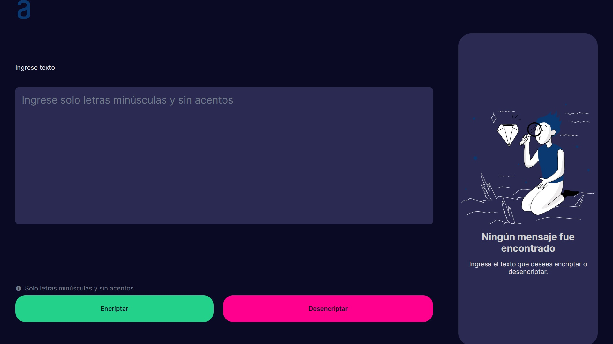

# Proyecto de Encriptación de Texto

Este proyecto es una aplicación web que permite encriptar y desencriptar texto utilizando reglas específicas de reemplazo de caracteres. También ofrece la funcionalidad de copiar el texto encriptado o desencriptado al portapapeles.

## Reglas de Encriptación

Las reglas de encriptación son las siguientes:

- La letra "e" se convierte en "enter"
- La letra "i" se convierte en "imes"
- La letra "a" se convierte en "ai"
- La letra "o" se convierte en "ober"
- La letra "u" se convierte en "ufat"

Ejemplo:

- "gato" se convierte en "gaitober"
- "gaitober" se convierte en "gato"

## Estilos Aplicados

La aplicación tiene una temática inspirada en el modo nocturno y tonalidades espaciales. Los colores principales utilizados son:

- **Fondo del cuerpo:** #0d0f12 (Negro espacial)
- **Texto principal:** #e2e8f0 (Gris claro)
- **Color de los botones principales:** #3a506b (Azul oscuro)
- **Color de fondo del textarea:** #1c1e26 (Gris oscuro)
- **Color de borde del textarea:** #3a506b (Azul oscuro)
- **Texto de mensaje:** #cbd5e0 (Gris claro)
- **Color de los botones secundarios:** #2c3e50 (Gris azul oscuro)

Estos estilos se han elegido para proporcionar una experiencia visual agradable y coherente con la temática espacial y nocturna del proyecto.

## Uso

1. Ingrese el texto que desea encriptar o desencriptar en el área de texto proporcionada.
2. Haga clic en el botón "Encriptar" para encriptar el texto o en el botón "Desencriptar" para desencriptarlo.
3. El resultado aparecerá en la sección de salida.
4. Puede copiar el texto resultante al portapapeles haciendo clic en el botón "Copiar".

## Captura de Pantalla

